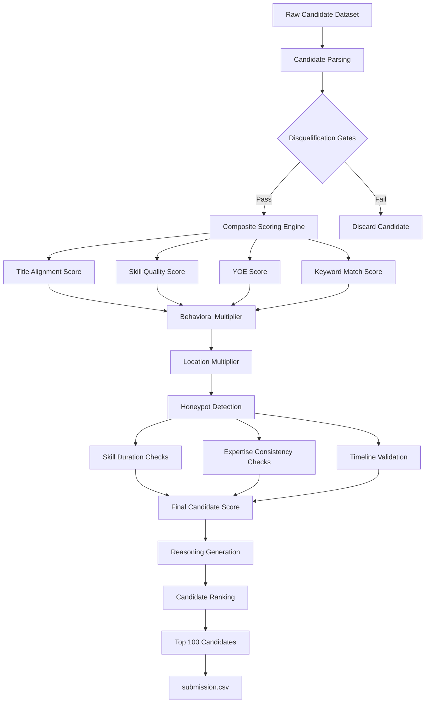

## 1. System Architecture

The pipeline is implemented as a single, highly-optimized script, `rank.py`, using only standard library modules to keep memory low and prevent dependencies.

### Pipeline Architecture Screenshot

### Processing Flow

### Disqualification Gates

1. **Services-Only Gate**: Filters out candidates who have only worked at services companies (`Infosys`, `Wipro`, `TCS`, `Capgemini`, `HCL`, `Accenture`, `Cognizant`, `Tech Mahindra`, `Mphasis`, `Genpact`).

2. **CV/Speech-Only Gate**: Filters out candidates whose skill set is entirely Computer Vision, Speech, or Robotics with zero NLP, Information Retrieval, or Search skills.

### Composite Scoring Model

\[
\text{Score} =
\text{Base Score}
\times
\text{Behavioral Multiplier}
\times
\text{Location Multiplier}
\times
(1.0 - \text{Honeypot Severity})
\]

- **Base Score**: Aligned titles (40%), skill quality matching (30%), YOE (20%), and summary keyword count (10%).
- **Behavioral Multiplier**: Factored from profile activity recency, recruiter response rate, response time, and notice period.
- **Location Multiplier**: Anchored to Pune/Noida, Delhi NCR, and willingness to relocate.
- **Honeypot Discount**: Computes severity based on skill duration excess, zero-duration expert skills, and calendar mismatches.
- **Plain-Language Tier 5 Boost**: Adds a flat boost (`+0.4`) for candidates with rare paraphrased skills (`Search Backend`, `Vector Representations`, `Ranking Systems`, etc.).
